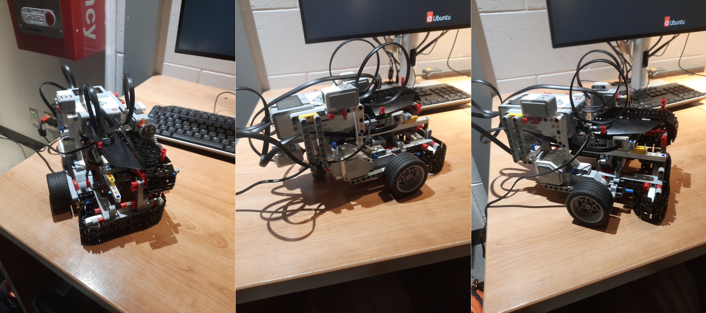

# CSCC85 Project 2 Localization

Program code for our localization robot. The robot was designed to have a colour sensor on a linear slide (implemented using tank treads) in order to have a near perfect alignment routine that did not rely on a continuous negative feedback loop to control. This design choice was made since negative feedback loops do not work well for small distances, as they regulate a value over time.

## Photos

## Features

- A colour sensor attached to a linear slide
- Touch sensors on either ends of the slide for event based control
- Gyro for turn measuring
- A localization algorithm based on probability diffusion that localizes within 2-3 data points
- Compact(ish?) design (for the feature set)

## Video